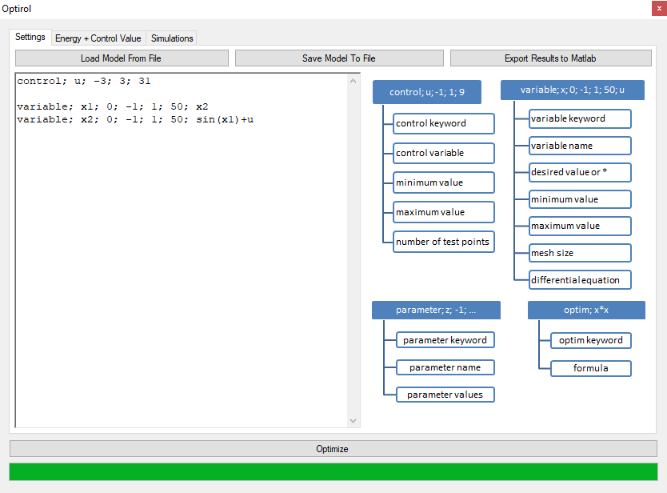
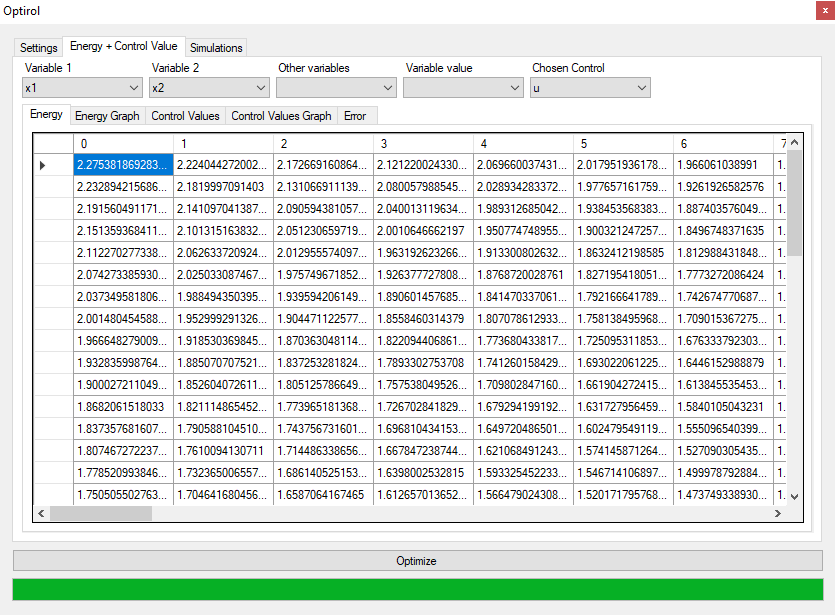
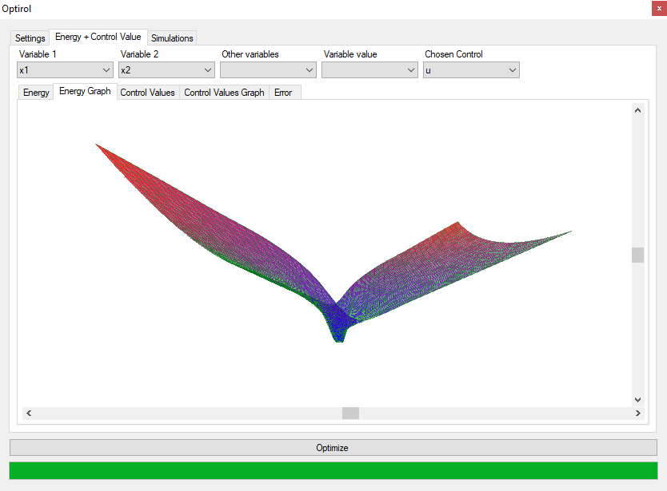
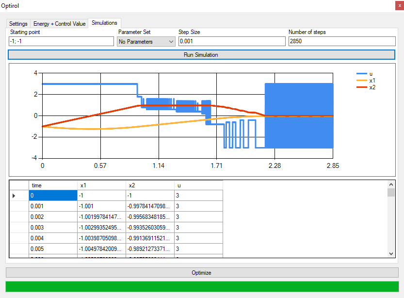

# Optirol
Optirol is a software for optimal control of nonlinear systems, which can be described by ordinary differential equations. Written in C#, now the code works in [Microsoft Visual Studio Community 2019](https://visualstudio.microsoft.com/vs/) and was updated using VS Community 2022 Preview 4. You might have to ['unblock' resx file](https://learn.microsoft.com/en-us/visualstudio/msbuild/errors/msb3821).

We present a novel algorithm for optimal control of nonlinear systems, which creates control function over a mesh on a region of interest. The algorithm oresented in this paper is an alternative to a set-oriented approach and subdivision algorithm for optimal control. The main contribution of this paper is error estimation for a found solution. We show on two dimensional and three dimensional problems, that this new algorithm is faster than a subdivision algorithm. In comparison with a set-oriented approach, the new algorithm keeps the same advanatges as the subdivision algorithm which include a smaller memory foot-print of the final solution, no need for discretization and knowledge when to stop increasing the mesh size.

Publications:
* P. Taraba: [Optimal Control for Nonlinear Systems](https://www.fei.stuba.sk/buxus/docs/2013/autoreferaty/Taraba.pdf), Ph.D. Thesis (chapter), Slovak University of Technology, February 2013

* P. Taraba: [Optimal Control Mesh](http://www.iaeng.org/publication/WCECS2012/WCECS2012_pp1110-1115.pdf), Proceedings of the World Congress on Engineering and Computer Science, IAENG, October 2012

* P. Taraba: [Subdivision algorithm for optimal control](https://onlinelibrary.wiley.com/doi/full/10.1002/rnc.2801), International Journal of Robust and Nonlinear Control, John Wiley & Sons, Ltd., March 2012

Dependencies (included as dll):
* [SharpGL](https://github.com/dwmkerr/sharpgl)
